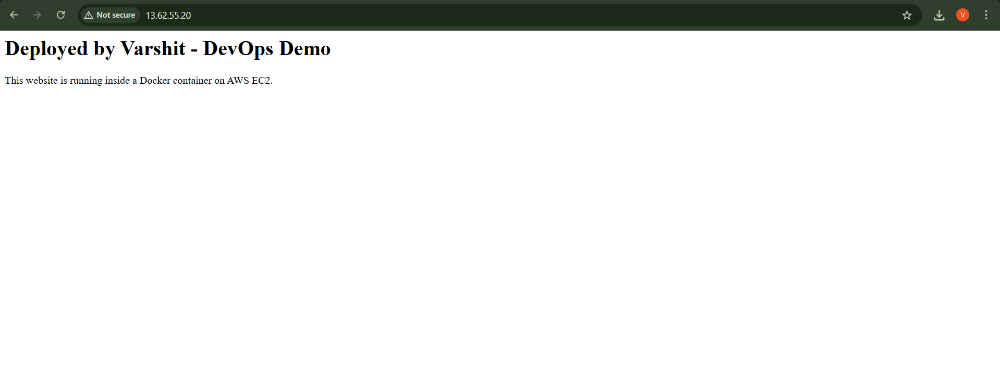

# DevOps Demo: Deploying a Website on AWS EC2 using Docker

This project demonstrates a simple DevOps workflow:

✔ Launch EC2 instance  
✔ Install Docker  
✔ Create a static website  
✔ Build a Docker image  
✔ Run the Docker container  
✔ Serve the website on port 80  
✔ Access it using the EC2 Public IP 

## 🖼 Output Screenshot

---

## 🛠 Commands Used

### Install Docker
```bash
sudo apt update -y
sudo apt install docker.io -y
sudo systemctl start docker
sudo systemctl enable docker


